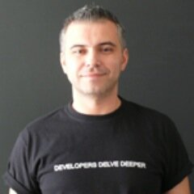

# Thessaloniki
# Ruby
# Meetup
# (thessrb)

---

 

# thessrb organizers

###  Vassilis Rizopoulos @arcandros

###  Petros Amiridis @amiridis

---

 

# thessrb organizers

###  Vassilis Rizopoulos @arcandros

###  Petros Amiridis @amiridis

###  Haris Dimitriou (me) @xarisd
 
---

 

# So what is thessrb?

> *thessrb is a group of (not just) geeks, who love Ruby (among other things), live (not just) in Thessaloniki (Greece), and meet at least once a month to throw some presentations (sometimes) and have fun afterwards during "HalaRuby" session (every time).*
-- https://github.com/thessrb/meetup

---

 

# 31 meetups! 

---

 

# !only Ruby 

---

# New open source project! 
# Join us!  
### https://github.com/thessrb/thessrbio

---

 

## thessrb.io

## git.io/thessrb-discuss

### github.com/thessrb

### meetup.com/thessrb

### twitter.com/thessrbio (#thessrb)

